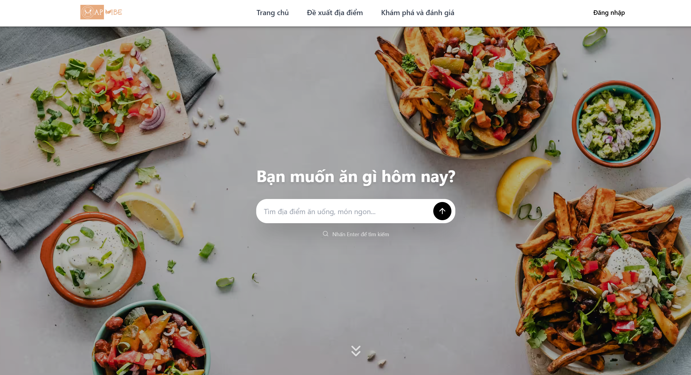
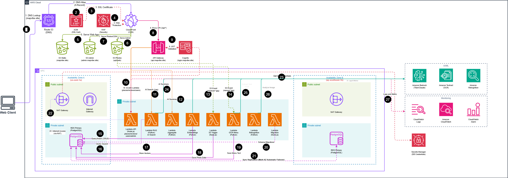

# MapVibe

<div align="center">

  <h1>MapVibe</h1>

  <p>
    <strong>
      AI-powered food and drink discovery platform<br/>
      Find your perfect spot based on mood, preferences, and real reviews.
    </strong>
  </p>

  <p>
    <a href="#features">Features</a> •
    <a href="#demo">Demo</a> •
    <a href="#tech-stack">Tech Stack</a> •
    <a href="#getting-started">Getting Started</a> •
    <a href="#deployment">Deployment</a>
  </p>

  <!-- Badges -->
  
  
  
  
  

</div>

<br />

## Demo

<div align="center">
  <video src="public/videos/mapvibe_demo.mp4" controls width="720">
    Your browser does not support the video
  </video>
  <p><em>Demo video</em></p>
</div>

<br />

<div align="center">
  
</div>

## Overview

**MapVibe** is a high-performance web application engineered for scalability and developer experience. Built as a monorepo using **TurboRepo** and **Bun**, it seamlessly integrates a modern React frontend with a robust serverless backend on AWS.

Whether you're looking for a solid foundation for your next SaaS or exploring modern full-stack patterns, MapVibe provides a production-ready architecture with type safety, shared UI components, and infrastructure-as-code.

## Architecture

<div align="center">
  
</div>

## SRS

- [Software Requirements Specification (SRS)](docs/[4N1D]-MapVibe-Proposal.docx)

## Features

- **High Performance:** Powered by [Bun](https://bun.sh) and [Vite](https://vitejs.dev) for lightning-fast builds and HMR.
- **Monorepo Architecture:** Efficiently managed with [TurboRepo](https://turbo.build), sharing code between apps and packages.
- **AWS Native:** Serverless infrastructure designed for AWS (Lambda, API Gateway, RDS).
- **End-to-End Type Safety:** Written in TypeScript with shared type definitions across frontend and backend.
- **Modern UI:** Built with React 19, TailwindCSS, and a custom shared component library.
- **Type-Safe Database:** PostgreSQL interaction using [Kysely](https://kysely.dev) for type-safe SQL queries.
- **Developer Experience:** Pre-configured ESLint, Prettier, and Husky for consistent code quality.

## Tech Stack

| Category | Technology | Description |
| :--- | :--- | :--- |
| **Monorepo** | [TurboRepo](https://turbo.build) | High-performance build system for JavaScript/TypeScript |
| **Runtime** | [Bun](https://bun.sh) | All-in-one toolkit for JavaScript apps |
| **Language** | [TypeScript](https://www.typescriptlang.org/) | Strongly typed programming language |
| **Frontend** | [React 19](https://react.dev) | The library for web and native user interfaces |
| **Styling** | [TailwindCSS](https://tailwindcss.com) | Utility-first CSS framework |
| **Backend** | [Node.js](https://nodejs.org) / AWS Lambda | Serverless compute |
| **Database** | PostgreSQL & [Kysely](https://kysely.dev) | SQL database with type-safe query builder |
| **Icons** | [Lucide React](https://lucide.dev) | Beautiful & consistent icons |
| **Infrastructure** | Terraform / CDK | Infrastructure as Code (IaC) |

## Project Structure

```bash
mapvibe/
├── apps/
│   ├── web/             # Main frontend application (React + Vite)
│   ├── admin/           # Admin dashboard application
│   └── api/             # Backend API service (Serverless functions)
├── packages/
│   ├── ui-components/   # Shared React UI component library
│   ├── types/           # Shared TypeScript definitions (DTOs, DB models)
│   ├── utils/           # Shared utility functions
│   └── eslint-config/   # Shared linting configuration
├── infrastructure/      # Infrastructure as Code (AWS resource definitions)
└── ...
```

## Getting Started

Follow these steps to set up your local development environment.

### Prerequisites

- **Bun**: >= 1.3.2 ([Install Bun](https://bun.sh/docs/installation))
- **Node.js**: >= 24.11.1
- **AWS CLI**: Configured with valid credentials (for deployment)

### Installation

1.  **Clone the repository:**

    ```bash
    git clone https://github.com/your-username/mapvibe.git
    cd mapvibe
    ```

2.  **Install dependencies:**

    ```bash
    bun install
    ```

3.  **Environment Setup:**

    You must create `.env` files for the root, `apps/web`, `apps/admin`, and `apps/api` directories.

    *Example `.env` content is often found in `.env.example` files within each directory.*

    > **Note:** For access to the correct environment variables, please contact the maintainer (see [Contact](#contact)).

### Development

Start the development servers for all applications:

```bash
bun run dev
```

This command uses TurboRepo to launch all apps in parallel.

### Other Commands

| Command | Description |
| :--- | :--- |
| `bun run build` | Build all packages/apps |
| `bun run lint` | Lint code |
| `bun run test` | Run tests |
| `bun run type-check` | Type check |
| `bun run clean` | Clean artifacts |

## Deployment

MapVibe includes scripts for deploying to AWS. Ensure you have the necessary AWS permissions.

| Command | Description |
| :--- | :--- |
| `bun run deploy:infra` | Deploy Infrastructure |
| `bun run deploy:web` | Deploy Web App |
| `bun run deploy:api` | Deploy API |
| `bun run deploy:migrate` | Run Database Migrations |

## Contributing

Contributions are welcome! Please feel free to submit a Pull Request.

1.  Fork the project
2.  Create your feature branch (`git checkout -b feature/AmazingFeature`)
3.  Commit your changes (`git commit -m 'Add some AmazingFeature'`)
4.  Push to the branch (`git push origin feature/AmazingFeature`)
5.  Open a Pull Request

## License

This project is licensed under the MIT License - see the [LICENSE](LICENSE) file for details.

## Contact

For environment variables or inquiries, please reach out:

- **Maintainer:** Minh
- **Facebook:** [Minh Nguyen](https://www.facebook.com/mikenguyen.ntm)
